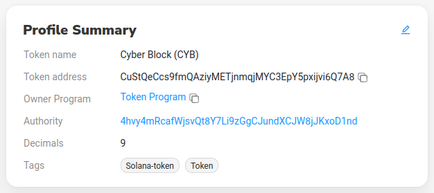

# Cyber Block Token

## Подаци о токену (Solscan)

### [Solscan.io](https://solscan.io/token/CuStQeCcs9fmQAziyMETjnmqjMYC3EpY5pxijvi6Q7A8)
---
### Основни подаци

---
- Токен адреса: CuStQeCcs9fmQAziyMETjnmqjMYC3EpY5pxijvi6Q7A8
- Токен име: Cyber Block
- Токен симбол: CYB
- Укупан број токена: 10,000,000.00
- Децимала: 9
---
### Остали подаци

---

## Употреба

Токен креиран на Solana blockchain мрежи.
Верификован и додат на листу Solana токена.

### Слање/Примање
--- 
Токен се не налази ни на једној мењачници, што значи да не може да се купи новцем, тренутно једини начин да се шаље/прима, јесте да главни wallet где је токен креиран шаље другом wallet-у. 
При слању са главног wallet-а на други, главни wallet мора да плати трошкове креирања account-a који може да чува токене, у овом случају Cyber Block токен. 
Такође главни wallet плаћа и fee(цена трансакције на Solana blockchain мрежи). 
Како би главни wallet платио износе, мора имати на располагању криптовалуту SOL(Solana) помоћу које плаћа износе.

---
Тренутна цена креирања account-a износи око 0.00001 SOL (0,0018 долара тренутно), а цена трансакције износи око 0.0000015 SOL (0.00025 долара тренутно). 
Solana тренутно(2021) има најјефтиније цене трансакција у односу на све криптовалуте.

---
Токен може извршавати трансакције између wallet-а.
Да би се вршиле трансакције између wallet-а, главни wallet мора да креира account за сваки wallet и пошаље неку количину токена, како би wallet-и имали шта да шаљу/примају. 
Сваки wallet мора да има и минималну количину SOL како би плаћао трансакције слања.
